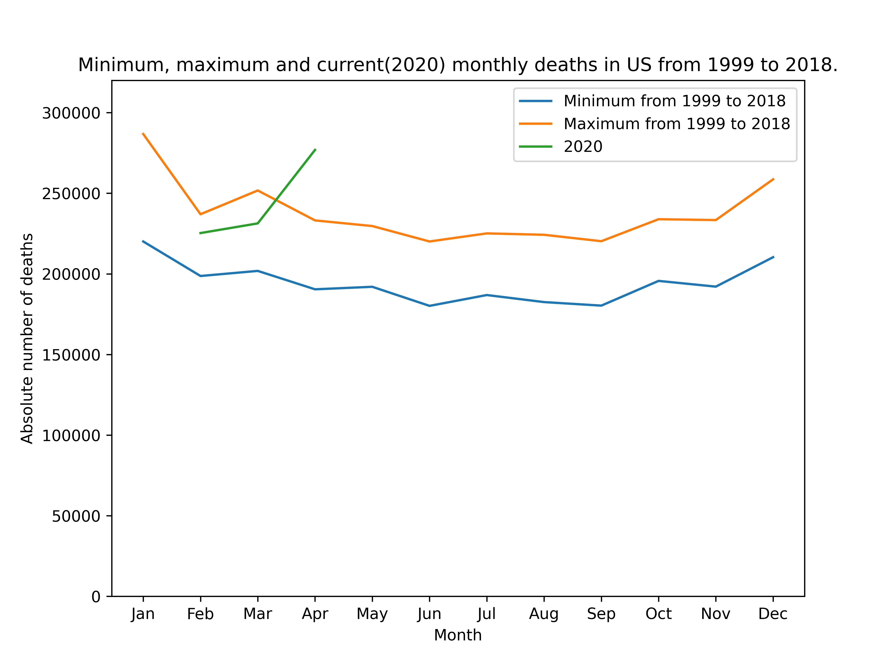
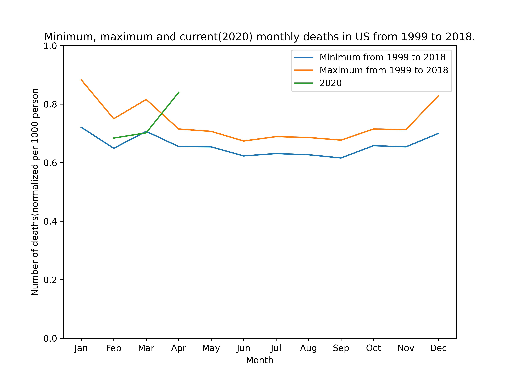

# COVID-19 deaths in US

This small analysis was done to show the increase in the monthly deaths
in the US during 2020(specifically Aprli).
At the time of this analysis, the official data for May 2020 was not available.
Also for some reason the deaths in the US in January 2020 was not available as well(if you have any source, please let me know).

***************** ** **
    Warning: some of the numbers are an accurate estimation.
    Not all numbers are taken directly from the sources, for example:
        to calculate the number of deaths in 2020, the weekly numbers were
        summed up to transfer the data to monthly basis.
** ** **

Sources:

    1. https://www.law.com/texaslawyer/2020/04/17/total-u-s-death-rate-is-still-below-average-cdc-412-96700/
    
    2. https://www.cdc.gov/nchs/nvss/vsrr/provisional-tables.htm
    
    3. https://wonder.cdc.gov/

# Results

